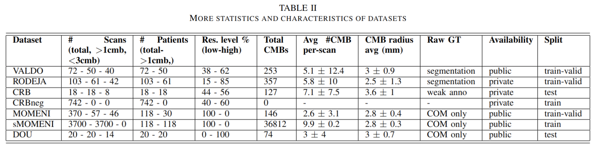
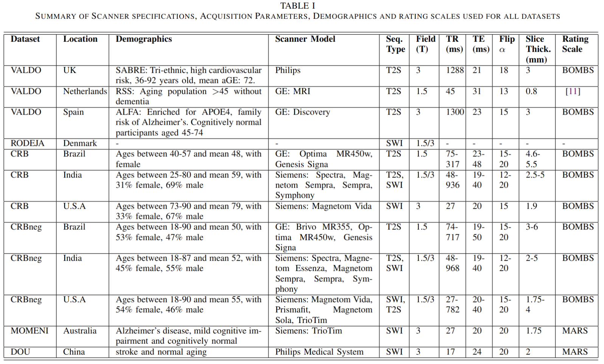

# MicrobleedNet

Repository containing source code, data and results for paper "MicrobleedNet: A robust Deep Learning model to segment and
detect cerebral microbleeds on MRI", which is going to be presented at [MICCAI 2024](https://conferences.miccai.org/2024/en/) Workshop. This project was conducted as part of my 30 ECTS Master's thesis done in collaboration with [CEREBRIU company](https://cerebriu.com/) during my MSc in Data Science at [IT University of Copenhagen (ITU)](https://en.itu.dk/).

The goal is to develop a 3D U-Net based model designed for robust segmentation and detection of cerebral microbleeds. We first combine several datasets form different origins into a common template after extensive cleaning, label refinement (and a annotation) and preprocessing. Then, we leverage pre-trained weights from another model trained on various cerebral pathologies. First an extra pretraining phase utilizing synthetic microbleeds and negative samples added to out training data is performed. Then, we remove these and fine-tune on more refined data. Evaluation is performed on independent datasets.

Some points covered:
- Patch sampling strategy
- Data augmentations
- Label refinement through image processing algorithms
- Data preprocessing and post-processing
- Data annotation (by radiologists) coordination 
- Shape analysis
- Performance analysis

NOTE: THIS IS STILL WORK IN PROGRESS
To see results from preliminary work (7.5 ECTS research course) please go to [Segmentation_CMB](https://github.com/jorgedelpozolerida/Segmentation_CMB)

## Authors
- [*Jorge del Pozo Lerida*](https://www.linkedin.com/in/jorgedelpozolerida/) (ITU)(CEREBRIU)
- [*Veronika Cheplygina*](https://scholar.google.com/citations?user=4x1y2bwAAAAJ&hl=es) (ITU)
- [*Mathias Perslev*](https://scholar.google.com/citations?user=9HcOCGgAAAAJ&hl=en) (CEREBRIU)
- [*Silvia Ingala*](https://scholar.google.nl/citations?user=b9J6OG8AAAAJ&hl=nl) (CEREBRIU)
- [*Akshay Pai*](https://scholar.google.com/citations?user=b3GS8qgAAAAJ&hl=en) (CEREBRIU)

## Title
"MicrobleedNet: A robust deep learning model to segment and detect cerebral microbleeds on MRI"

## Abstract
WIP

## Repository structure overview

The following folders exist in the repository:

### [cmbnet](cmbnet/)

This folder is structured as a Python package with several modules and submodules. 
Scripts have many interdependencies and some are simply utility functions for other scripts. 

Most important commands are the following:

- [data_preprocessing.py](cmbnet/commands/data_preprocessing.py): preprocess a full dataset
- [data_post-processing.py](cmbnet/commands/data_post-processing.py): postprocesses predictions from model
- [evaluate.py](cmbnet/commands/evaluate.py): Used to evaluate the performance of the trained model.

Note: so far training and prediction are perfomed as part of a bigger MLOps codebase which could not be included in repo, so no specific scripts exists for that. Will add in the future functionality to run predict command as a Docker image (which preprocesses, predicts and postprocesses in one call)

### [data-misc](data-misc/)
Contains metadata form datasets preprocessing, splits files, training config files, images for report, CSVs generated for analysis...etc

### [notebooks](notebooks/)
Contains Python notebooks used to visualize and get overviews of different steps of the project

### [R](R/)
Contains R code used for different data anlysis and processing purposes

## Methods & Results
WIP

## Data

<!--  -->
