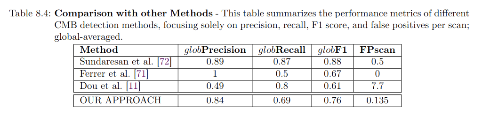

# MicrobleedNet

Repository containing source code, data and results for project "MicrobleedNet: A robust Deep Learning model to segment and
detect cerebral microbleeds on MRI". This project was conducted as part of my 30 ECTS Master's thesis done in collaboration with [CEREBRIU company](https://cerebriu.com/) during my MSc in Data Science at [IT University of Copenhagen (ITU)](https://en.itu.dk/).

To read full report please go to [report.pdf](report.pdf)

## Authors
- [*Jorge del Pozo Lerida*](https://www.linkedin.com/in/jorgedelpozolerida/) (ITU)(CEREBRIU)
- [*Veronika Cheplygina*](https://scholar.google.com/citations?user=4x1y2bwAAAAJ&hl=es) (ITU)
- [*Mathias Perslev*](https://scholar.google.com/citations?user=9HcOCGgAAAAJ&hl=en) (CEREBRIU)
- [*Silvia Ingala*](https://scholar.google.nl/citations?user=b9J6OG8AAAAJ&hl=nl) (CEREBRIU)
- [*Akshay Pai*](https://scholar.google.com/citations?user=b3GS8qgAAAAJ&hl=en) (CEREBRIU)

## Title
"Enhancing Detection of Cerebral Microbleeds: A Clinically Robust Deep Learning Framework"

## Abstract
Cerebral Microbleeds (CMBs) are neuroimaging biomarkers visible as small round hypointensities on magnetic resonance images (MRI) in T2*-weighted (T2S) or susceptibility-weighted imaging (SWI). Associated with over 30 medical conditions, the accurate quantification and localization of CMBs are crucial for diagnostic and prognostic assessments. However, their manual detection by radiologists is labor-intensive and error-prone, particularly when numerous CMBs present, positioning them as prime candidates for automated detection. Despite this, automation remains challenging due to CMBs' small size, the scarcity of publicly available annotated data, and their similarity to various other biological mimics. The interpretation of the performance of existing methods is compounded by a lack of standardized metrics and task definitions, incomplete metrics reporting, imperfect evaluations, and the absence of a robust benchmark for comparison. Current methods often exhibit suboptimal performance, characterized by a high rate of false positives, and are not trained or evaluated on data representative of the variations found in clinical settings, which typically include a broad range of demographic, pathological, and MRI data variation. In this study, we develop a sequence-agnostic model applicable to SWI or T2S that is robust against the data variation commonly found in real-life clinical settings. We enhance our model's robustness through the curation of a large collection of public and private data, supplemented by advanced data augmentation and an initial pretraining phase with a large set of negative samples and synthetic CMBs. In parallel, we investigate the benefit of using transfer learning from a bigger source segmentation task with a larger and more representative dataset but find no tangible improvement. We conduct a rigorous evaluation first on a public dataset for benchmarking our model, achieving 69\% recall and 84\% precision across the entire test set with an average of 0.1 false positives per scan. Next, we evaluate the model on an in-house annotated dataset, crafted to simulate challenging real-life conditions. Performance metrics show a drop to 30\% recall and 70\% precision, with 0.13 false positives per scan. We find that the reason is the model struggling with insufficient slice thickness, which makes CMBs that look elongated like veins become false negatives. Additionally, the high number of CMBs per scan poses a significant challenge and leads us to raise concerns about the reliability of inter-rater agreement assessments for existing rating methods.

## Project Aim
We aim to develop an automated system capable of accurately detecting CMBs on MRI images of high clinical and technical variability, with the ultimate goal of providing significant clinical value and overcoming the gaps identified in previously published methods. To achieve this, we do the following:

To this end, we have designed a sequence-agnostic deep learning model, capable of working on the two most commonly employed MRI sequences for CMB detection: T2*-weighted Gradient Recalled Echo and Susceptibility Weighted Imaging.  To enhance the robustness of our model, we have implemented a comprehensive strategy that includes the creation of a large collection of both public and private CMB datasets. These datasets have been meticulously processed and enhanced with data augmentation techniques to reflect the variety of data variations typically encountered in clinical environments. Additionally, we utilize synthetic datasets and a significant amount of internally available negative data during an initial pre-training phase. In parallel, we explore the potential benefits of utilizing a pre-trained model for closely related tasks, aiming to leverage extensive data variations present in its training dataset.

Addressing the challenges found in the literature concerning the evaluation CMB detection methods, we conduct an in-depth performance evaluation that adheres to best practices in medical image analysis. This evaluation is meticulously performed on completely independent test sets—one publicly available for benchmarking our method and another privately collected to accurately reflect the diverse and challenging data variations encountered in clinical practice. Through this rigorous evaluation process, we aim to uncover and address potential flaws and challenges within our solution, the data, and the inherent complexities of the task itself.

## Repository structure overview

The following folders exist in the repository:

### [cmbnet](cmbnet/)

This folder is structured as a Python package with several modules and submodules. 
Scripts have many interdependencies and some are simply utility functions for other scripts. 

Some of the main scripts are the following:

- [data_preprocessing.py](cmbnet/commands/data_preprocessing.py): preprocess a full dataset
- [data_post-processing.py](cmbnet/commands/data_post-processing.py): postprocesses predictions from model
- [evaluate_CMBlevel.py](cmbnet/commands/evaluate_CMBlevel.py): Used to evaluate the performance of the trained model at a CMB level.
- [generate_radiomics_metadata.py](cmbnet/analysis/generate_radiomics_metadata.py)

Many other scripts exist for various purposes the project, all of whih are docuemnted with self-explanatory name.

Note: training and prediction are perfomed as part of a bigger MLOps codebase which could not be included in repo

### [data-misc](data-misc/)
Contains metadata from datasets preprocessing, splits files, training config files, images for report, CSVs generated for analysis...etc

### [notebooks](notebooks/)
Contains Python notebooks used to visualize and get overviews of different steps of the project

### [R](R/)
Contains R code used for different data anlysis and processing purposes

## Some results

Comparison with other published methods on CMB object detection ([link here](https://www.cse.cuhk.edu.hk/~qdou/cmb-3dcnn/cmb-3dcnn.html)) and task:

To see results from preliminary work (7.5 ECTS research course) please go to [Segmentation_CMB](https://github.com/jorgedelpozolerida/Segmentation_CMB)
